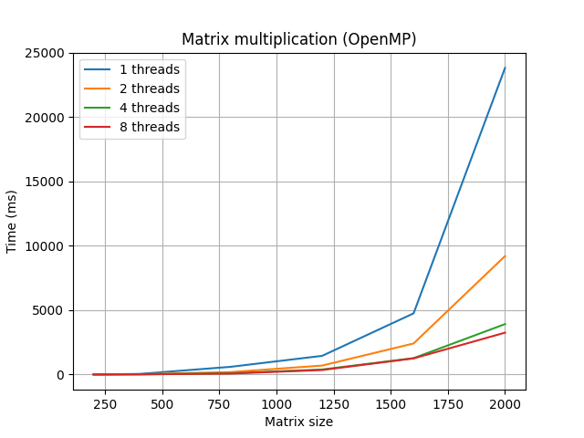

# Лабораторная работа №2  
## Параллельные вычисления с использованием OpenMP

---

# Цель работы

Изучить применение технологии OpenMP для параллельного выполнения алгоритма умножения матриц и исследовать влияние количества потоков на производительность программы.

---

# Задание

Модифицировать программу из лабораторной работы №1 для параллельной работы с использованием OpenMP.  
Провести серию экспериментов с разным количеством потоков (1, 2, 4, 8 и т.д.), а также с различными размерами матриц.

---

# Ход работы

В ходе работы программа из первой лабораторной работы была адаптирована для использования технологии OpenMP.  
Был реализован параллельный алгоритм умножения квадратных матриц.

Проведены эксперименты для различных размеров матриц и количества потоков процессора.

---

# Оборудование

**AMD Ryzen 5 3600 6-Core Processor **

Компиляция и запуск программы выполнялись в:
**Microsoft Visual Studio Community 2022**

Использовалась поддержка OpenMP (включена в настройках проекта).

---

# Методика эксперимента

Проводились замеры времени выполнения алгоритма умножения матриц для следующих параметров:

## Размеры матриц:
- 200
- 400
- 800
- 1200
- 1600
- 2000

## Количество потоков:
- 1
- 2
- 4
- 8

---

# Результаты экспериментов

## Время выполнения (мс)

| Size | 1 thread | 2 threads | 4 threads | 8 threads |
|------|----------|-----------|-----------|-----------|
| 200  | 4        | 3         | 2         | 3         |
| 400  | 44       | 21        | 11        | 11        |
| 800  | 599      | 189       | 98        | 75        |
| 1200 | 1451     | 696       | 391       | 349       |
| 1600 | 4754     | 2414      | 1272      | 1252      |
| 2000 | 23834    | 9206      | 3917      | 3252      |

---

# Анализ результатов

Из полученных данных видно, что:

- При малых размерах матриц (200×200) ускорение практически отсутствует, так как накладные расходы на создание потоков сопоставимы с временем вычислений.
- При увеличении размера задачи наблюдается значительное ускорение выполнения программы при использовании многопоточности.
- Наибольшее ускорение достигается при 4–8 потоках.
- Дальнейшее увеличение количества потоков даёт меньший прирост производительности из-за ограничений пропускной способности памяти и накладных расходов на синхронизацию.

---

# Вывод

В ходе выполнения лабораторной работы была изучена технология OpenMP и реализован параллельный алгоритм умножения матриц.

Было установлено, что:

- использование многопоточности эффективно только для больших объёмов данных;
- ускорение выполнения программы не является линейным из-за аппаратных ограничений;
- оптимальное количество потоков для данной задачи составляет 4–8.

Таким образом, цель работы была достигнута: исследовано влияние числа потоков на производительность параллельного алгоритма.