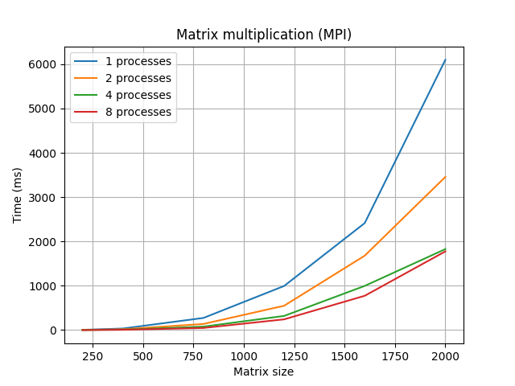

# Лабораторная работа 3 — MPI

## Задание

Модифицировать программу умножения матриц для параллельной работы с использованием технологии MPI.  
Провести эксперименты для различных размеров матриц и количества процессов.

---

## Оборудование

Все тесты проводились на процессоре:

Intel(R) Xeon(R) CPU E5-2666 v3 @ 2.90GHz  

---

## Среда разработки

- Visual Studio 2022  
- Microsoft MPI  
- Язык: C++

---

## Ход работы

В ходе работы была реализована программа параллельного умножения матриц с использованием MPI.

Особенности реализации:

- матрицы считываются из файлов (`data/`)
- данные распределяются между процессами:
  - матрица A делится по строкам (`MPI_Scatter`)
  - матрица B рассылается всем процессам (`MPI_Bcast`)
- каждый процесс вычисляет свою часть результата
- итог собирается с помощью `MPI_Gather`

---

## Тестирование

Проводились эксперименты для:

- размеров матриц: 200, 400, 800, 1200, 1600, 2000
- количества процессов: 1, 2, 4, 8

---

## Результаты

| Размер | 1 процесс | 2 процесса | 4 процесса | 8 процессов |
|--------|----------|------------|------------|-------------|
| 200    | 4        | 2          | 1          | 0           |
| 400    | 34       | 17         | 8          | 6           |
| 800    | 273      | 137        | 77         | 47          |
| 1200   | 994      | 548        | 318        | 241         |
| 1600   | 2414     | 1678       | 996        | 773         |
| 2000   | 6099     | 3456       | 1827       | 1775        |

---

## Графики

### Зависимость времени от размера матрицы

---

## Выводы

- При увеличении числа процессов время выполнения уменьшается
- На малых размерах матриц ускорение незначительное из-за накладных расходов MPI
- На больших матрицах наблюдается существенное ускорение
- MPI показывает хорошую масштабируемость при росте объёма данных

---

## Итог

В ходе лабораторной работы была реализована и исследована параллельная программа с использованием MPI.  
Проведённые эксперименты показали эффективность распараллеливания при больших объёмах вычислений.